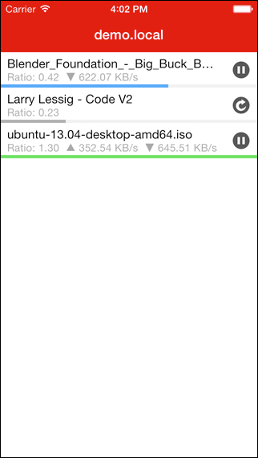

# Transmission-iOS

## Description

A [Transmission](http://www.transmissionbt.com) client for iOS.

Designed for a single purpose: quick management of BitTorrent transfers within your home network.  No network configuration is required, it will automatically connect to the first available Transmission instance.

## Usage

### Building
- Load submodules

        git submodule update --init --recursive

- Build and run the project using Xcode.

### Running
- To enable remote access to your Transmission desktop client:
  - Transmission > Preferences > Remote
  - Enable Remote Access: YES
  - Display the web interface with Bonjour: YES
  - Require authentication: Optional

## Dependencies

- AFNetworking
- BPFoundation
- MagicalRecord

## License

MIT - See LICENSE.txt

## Thanks

The Transmission dev team for years of great work.

[Entertica](http://www.entertica.com) for posting such a great [icon](http://entertica.tumblr.com/post/204376537/transmission-for-brurry) to their blog.

## Contact

[Brian Partridge](http://brianpartridge.name) - @brianpartridge on [Twitter](http://twitter.com/brianpartridge) and [App.Net](http://alpha.app.net/brianpartridge)